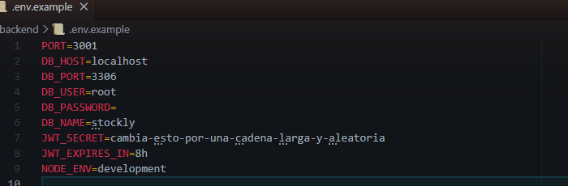
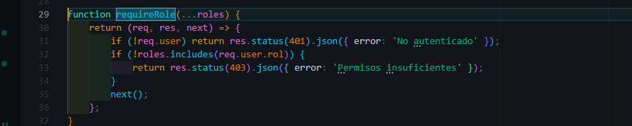
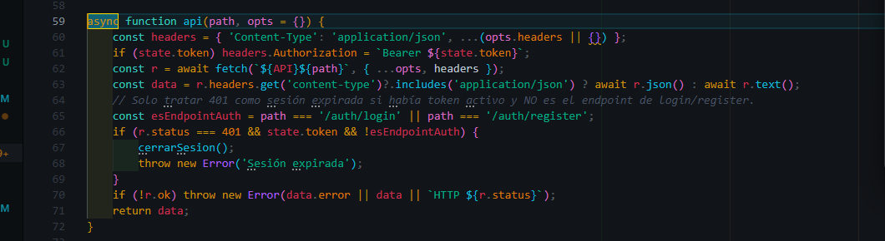
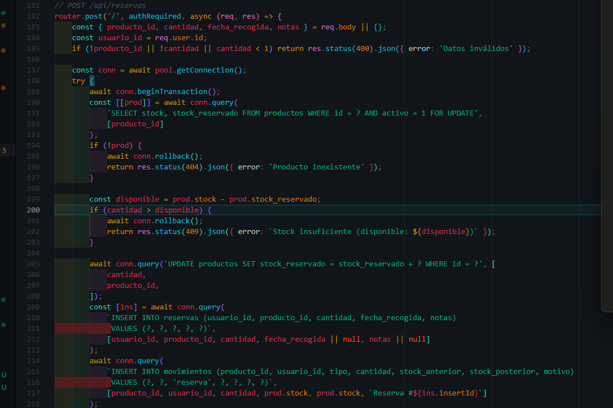
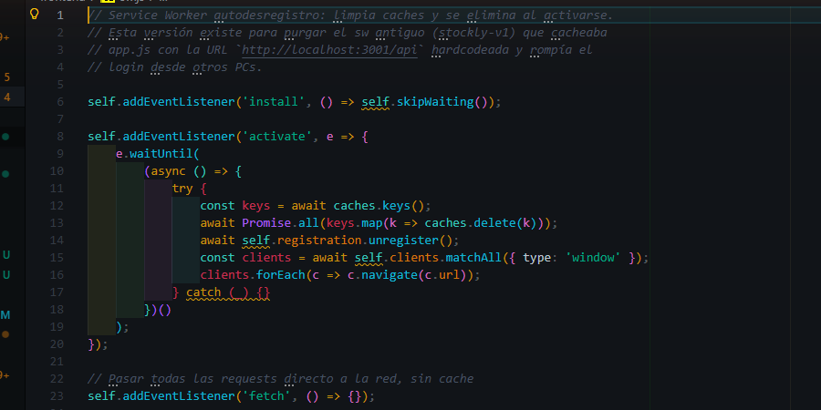
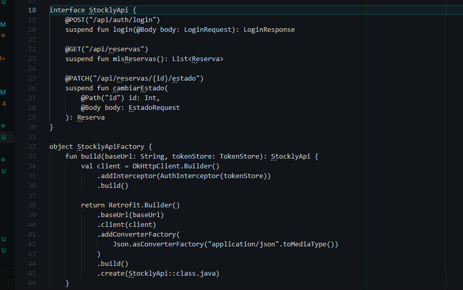

# Stockly — Sistema de gestión y reservas de almacén

**Trabajo Fin de Ciclo · Desarrollo de Aplicaciones Multiplataforma (DAM)**

---

## Portada

- **Título:** Stockly — Sistema de gestión de inventario y reservas para almacén
- **Alumnos:** Adrián Bravo Santos y Miguel Ángel Florido
- **Ciclo formativo:** Desarrollo de Aplicaciones Multiplataforma (DAM)
- **Centro educativo:** *[a completar]*
- **Curso académico:** 2025/2026
- **Tutor/a:** *[a completar]*
- **Fecha de entrega:** *[a completar]*

---

## Resumen

Stockly es una aplicación web (PWA) para gestionar inventario y reservas en un almacén pequeño-mediano. Resuelve un problema concreto: en muchas pymes la trazabilidad de stock sigue en hojas de cálculo, las reservas se anotan sin control de concurrencia y los movimientos no quedan auditados. Stockly centraliza catálogo, stock, reservas y movimientos con tres roles (cliente, operario, admin), API REST con JWT, control de concurrencia a nivel de BD e interfaz responsive instalable como PWA. **Tecnologías:** Node.js + Express, MySQL 8, JavaScript vanilla, Service Worker, JWT, bcrypt, Vitest, Kotlin + Jetpack Compose (app móvil, fase final). **Resultado:** sistema operativo con catálogo de 500 productos, gestión de reservas concurrentes, dashboard con KPIs, exportación CSV, modo oscuro e instalador Windows. Tests automatizados sobre los flujos críticos. Pendiente: despliegue cloud y app móvil nativa.

## Abstract

Stockly is a PWA for inventory and reservation management in small to medium warehouses. It addresses a real problem: stock traceability is still handled on spreadsheets in many SMBs, reservations are taken without concurrency control, and movements are not audited. Stockly centralizes catalog, stock, reservations and movements with three roles (client, operator, admin), a REST API with JWT, database-level concurrency control and a responsive UI installable as a PWA. **Stack:** Node.js + Express, MySQL 8, vanilla JavaScript frontend, Service Worker, JWT, bcrypt, Vitest, Kotlin + Jetpack Compose (mobile, final phase). **Outcome:** operational system with 500-product catalog, concurrent reservations, KPI dashboard, CSV export, dark mode and Windows installer. Automated tests on critical flows. Pending: cloud deployment and native mobile app.

## Palabras clave

API REST · Node.js · Express · MySQL · JWT · PWA · Service Worker · Kotlin · Jetpack Compose · Vitest · GitHub Actions

---

## Índice

<!-- TOC_PLACEHOLDER -->

---

# 1. Introducción

## 1.1 Contexto

En muchas pymes —tiendas, talleres, almacenes de distribución— el inventario se gestiona con hojas de cálculo compartidas o anotaciones en papel. Cuando varias personas trabajan a la vez sobre el mismo stock aparecen ventas duplicadas, reservas olvidadas y movimientos sin trazabilidad. Stockly se diseña como un sistema ligero pero serio: web instalable, API propia y control de concurrencia real.

## 1.2 Objetivos

**General:** desarrollar una aplicación web (con extensión móvil nativa) para gestionar inventario y reservas de un almacén, con autenticación por roles, control de concurrencia y trazabilidad de movimientos, desplegable en cloud y accesible públicamente.

**Específicos:** (a) modelar un esquema relacional normalizado; (b) construir una API REST con JWT y control de acceso por rol; (c) garantizar reservas concurrentes consistentes con `SELECT … FOR UPDATE`; (d) implementar un frontend SPA responsive instalable como PWA, con modo oscuro; (e) desarrollar una app Android nativa en Kotlin para el operario; (f) desplegar el sistema en un proveedor cloud con HTTPS y dominio propio; (g) cubrir con tests automatizados los flujos críticos.

## 1.3 Motivación

Aplicar de forma cohesionada los contenidos del ciclo: modelado de datos, API REST, autenticación, frontend, control de concurrencia, PWA, despliegue, pruebas y Android nativo. El acoplamiento entre módulos es lo que pone a prueba lo aprendido.

## 1.4 Tecnologías

- **Backend:** Node.js 24 LTS, Express 4, mysql2, bcryptjs, jsonwebtoken, helmet, cors, compression, morgan, express-rate-limit.
- **Frontend:** JavaScript ES2020 vanilla (sin framework), CSS3 con tokens y modo claro/oscuro, Service Worker, Web App Manifest.
- **Base de datos:** MySQL 8 (compatible MariaDB) con `utf8mb4_unicode_ci`.
- **Cloud / DevOps (planificado):** Render / Fly.io / VPS, GitHub Actions, Let's Encrypt.
- **Tooling:** Vitest, ESLint, Git + GitHub, Claude Code y GitHub Copilot como asistentes (cap. 9).
- **App móvil (fase final):** Kotlin, Jetpack Compose, Retrofit + OkHttp, Room, CameraX + ML Kit Barcode, EncryptedSharedPreferences + BiometricPrompt.

---

# 2. Análisis y diseño del sistema

## 2.1 Descripción general

Stockly consta de tres componentes: (1) **backend** Node/Express con API REST `/api/auth`, `/api/productos`, `/api/categorias`, `/api/reservas`, `/api/admin`; (2) **frontend PWA** servido por el propio backend, con modo offline básico; (3) **app móvil Android nativa** (Kotlin, en desarrollo) específica para el operario. El sistema gestiona catálogo, reservas con estado (pendiente / confirmada / cancelada / entregada), auditoría automática de movimientos, dashboard con KPIs, importación CSV y albarán imprimible.

## 2.2 Roles de usuario

| Rol           | Capacidades                                                                                        |
|---------------|----------------------------------------------------------------------------------------------------|
| Cliente       | Navegar catálogo, crear y ver sus reservas, editar perfil.                                         |
| Operario      | Lo anterior + procesar reservas (confirmar, entregar, cancelar), consultar stock global.            |
| Administrador | Lo anterior + CRUD de productos y categorías, gestión de usuarios, dashboard, importación CSV.     |

Autorización en dos capas: middleware Express `requireRole` en cada ruta protegida y filtrado en frontend según el rol contenido en el JWT.

## 2.3 Requisitos funcionales

| ID    | Requisito                                                                                  |
|-------|--------------------------------------------------------------------------------------------|
| RF-01 | Autenticación con email + contraseña → JWT firmado.                                        |
| RF-02 | Registro anónimo con rol `cliente`.                                                        |
| RF-03 | Catálogo paginado con búsqueda y filtro por categoría/stock.                               |
| RF-04 | Reserva de N unidades por cliente autenticado si hay stock disponible.                     |
| RF-05 | Concurrencia: dos reservas paralelas no pueden superar el stock.                           |
| RF-06 | Transiciones de estado por operario (pendiente → confirmada → entregada / cancelada).      |
| RF-07 | CRUD de productos por admin.                                                                |
| RF-08 | Dashboard `/api/admin/stats` con KPIs agregados.                                            |
| RF-09 | Toda modificación de stock genera registro en `movimientos`.                                |
| RF-10 | Importación CSV de productos en lote con validación fila a fila.                            |
| RF-11 | Exportación CSV de reservas filtradas.                                                      |
| RF-12 | Instalable como PWA con cache del shell.                                                    |
| RF-13 | Albarán A4 imprimible al entregar.                                                          |

## 2.4 Requisitos no funcionales

- **Seguridad.** Contraseñas con bcrypt (cost 10). JWT firmado con secreto ≥ 256 bits autogenerado al primer arranque. Rate limiting en `/api/auth` (30 req / 15 min). Helmet, CORS, *prepared statements*.
- **Rendimiento.** Respuestas de catálogo < 200 ms con 500 productos. Compresión gzip. Service Worker para arranque < 1 s en segundo acceso.
- **Escalabilidad.** Backend *stateless*: la sesión vive en el JWT; cualquier nodo puede atender cualquier petición. Estado en MySQL.
- **Disponibilidad.** Objetivo ≥ 99% mensual tras despliegue cloud. Backups diarios.
- **Mantenibilidad.** Estructura por capas, tests sobre flujos críticos, lint en CI.
- **Accesibilidad.** Objetivo WCAG AA: foco visible, contraste 4.5:1, ARIA en elementos clave (pendiente — ROADMAP 5.10).

## 2.5 Casos de uso

**CU-01 Login.** Usuario introduce credenciales → backend valida con `bcrypt.compare` y firma JWT → frontend persiste token y carga vista según rol.

**CU-02 Reservar producto.** Cliente abre ficha → indica cantidad → backend inicia transacción, hace `SELECT … FOR UPDATE` sobre la fila del producto, valida stock, crea reserva en `pendiente` y registra movimiento. Si otro usuario reservó antes, devuelve 409.

**CU-03 Entregar reserva.** Operario abre la cola, marca entrega → sistema descuenta stock, cambia estado a `entregada`, registra movimiento `salida` y (opcional) imprime albarán A4.

**CU-04 Crear producto.** Admin abre FAB → formulario (SKU, nombre, categoría, precio, stock, mínimo, unidad) → persiste y refresca lista.

**CU-05 Importar CSV.** Admin selecciona CSV con cabecera esperada → previsualización con filas válidas / con error → confirma → inserción en transacción.

> Diagramas UML en `docs/diagrams/casos-de-uso.drawio` *(pendiente de exportar — ROADMAP 4.8)*.

## 2.6 Diseño de interfaces (Figma)

Tres iteraciones del sistema de diseño: (1) **v1** dashboard SaaS genérico con glassmorphism — útil para validar arquitectura de información pero poco diferenciado; (2) **v2** industrial recargado: acero + ámbar, esquinas rectas, biseles metálicos, remaches, hazard tape, fuentes condensadas (Oswald, Barlow) — coherente con el dominio pero visualmente saturado; (3) **v3 actual**: se conservan tipografía y esquinas rectas pero se eliminan gradientes, texturas y remaches. Acento ocre como firma. Resultado minimalista industrial: respira mejor y mejora el contraste.

Pantallas: Login/Registro, Catálogo (cards), Detalle de producto, Mis reservas (cliente), Cola de reservas (operario), Dashboard (admin), Inventario (admin), modales de CRUD. Bocetos y mockups en `docs/figma/` *(pendiente de exportar)*.

## 2.7 Arquitectura general

Cliente web (PWA) y app Android consumen la misma API REST sobre HTTPS, autenticándose con JWT en cabecera `Authorization`. El backend Express es *stateless* y conecta con MySQL mediante el driver `mysql2` con *prepared statements*. El servicio se desplegará en un proveedor cloud (Render / Fly.io / VPS) con TLS y dominio propio, con CI/CD desde GitHub Actions.

```
Navegador (PWA)      Android nativo (Kotlin)
       \                    /
        HTTPS + JWT (mismo origen / mismo host)
                \  /
         Backend Node.js + Express
         (auth, productos, categorías,
          reservas, admin · helmet, cors,
          rate-limit, JWT, requireRole)
                  |
                  v
              MySQL 8
       (5 tablas · FK · índices)
```

> Diagramas de arquitectura y despliegue en `docs/diagrams/` *(pendiente — ROADMAP 4.8)*.

---

# 3. Diseño de la base de datos

## 3.1 Modelo entidad-relación

Entidades: **usuarios**, **categorias**, **productos**, **reservas**, **movimientos**.

Relaciones: `productos.categoria_id → categorias.id` (1\:N, ON DELETE SET NULL), `reservas.usuario_id → usuarios.id` y `reservas.producto_id → productos.id` (N\:1), `movimientos.producto_id → productos.id` (N\:1, ON DELETE CASCADE) y `movimientos.reserva_id → reservas.id` (N\:1 opcional). Diagrama E/R en `docs/diagrams/er.drawio` *(pendiente)*.

## 3.2 Diseño lógico

- Charset `utf8mb4`, collation `utf8mb4_unicode_ci`.
- PK `INT UNSIGNED AUTO_INCREMENT`. Timestamps `DATETIME DEFAULT CURRENT_TIMESTAMP` con `ON UPDATE` donde procede.
- Estados como `ENUM('pendiente','confirmada','cancelada','entregada')` para integridad.
- Índices secundarios sobre `productos.sku`, `productos.categoria_id`, `reservas.estado` y `(reservas.producto_id, estado)`.

## 3.3 Relaciones y claves

Todas las FK tienen política `ON DELETE` explícita. Índice `UNIQUE` sobre `productos.sku` y `usuarios.email` para impedir duplicados.

## 3.4 Scripts SQL

Esquema completo y semillas en [`db/schema.sql`](db/schema.sql). El script se aplica automáticamente la primera vez que `start.bat` arranca el sistema; en producción se aplicará vía la conexión MySQL del proveedor.

## 3.5 Datos de prueba (seed)

3 usuarios demo (admin, operario, cliente — contraseña `password123`, **cambiar en producción**), 8 categorías base, ~500 productos generados con SKU/nombre/precio/stock coherentes y varias reservas en distintos estados.

---

# 4. Desarrollo del backend

## 4.1 Arquitectura

`backend/server.js` arranca Express con middlewares globales (helmet, cors, compression, morgan, rate-limit) y monta los routers. Estructura:

```
backend/
├── server.js
└── src/
    ├── db.js                # pool mysql2/promise
    ├── ensure-jwt-secret.js # genera/persiste JWT_SECRET fuerte
    ├── middleware/auth.js   # authRequired + requireRole
    └── routes/{auth, productos, categorias, reservas, admin}.js
```

Cada ruta es un router Express que importa el pool y el middleware. La lógica vive en el handler porque el dominio es pequeño y abstracciones extra serían ceremonia.

## 4.2 Configuración inicial

`backend/package.json` declara dependencias y scripts (`npm start`, `npm test`, `npm run lint`). Variables de entorno en `backend/.env`, generado desde `backend/.env.example`:



## 4.3 Conexión a la BD

`src/db.js` crea un pool `mysql2/promise` con `connectionLimit: 10`. Todas las consultas usan *prepared statements* (`pool.execute(sql, [params])`) para prevenir SQL injection.

## 4.4 API REST — rutas principales

| Método | Ruta                          | Auth      |
|--------|-------------------------------|-----------|
| POST   | /api/auth/{register, login}   | —         |
| GET    | /api/auth/me                  | JWT       |
| GET    | /api/productos[/:id]          | JWT       |
| POST/PUT/DELETE | /api/productos[/:id] | admin     |
| GET    | /api/categorias               | JWT       |
| POST/PATCH/DELETE | /api/categorias | admin    |
| GET    | /api/reservas                 | JWT       |
| POST   | /api/reservas                 | JWT       |
| PATCH/DELETE | /api/reservas/:id       | op./admin |
| GET    | /api/admin/stats              | admin     |
| POST   | /api/admin/usuarios           | admin     |

## 4.5 CRUD y 4.6 Validaciones

Cada entidad sigue GET (lista/detalle), POST (crear), PUT/PATCH (editar), DELETE (eliminar). Validación manual en cada handler (`if (!body.nombre) return res.status(400)…`); pendiente migrar a Zod para esquemas centralizados (ROADMAP 7.4).

## 4.7 Manejo global de errores

Middleware final `app.use((err, req, res, next) => …)` serializa cualquier excepción a JSON con `status` y `message`. En `NODE_ENV=production` no se exponen *stack traces*.

## 4.8 Autenticación y autorización

Login: `bcrypt.compare` valida la contraseña; el servidor firma un JWT HS256 con `{ id, email, rol }` y expiración 7 días. El secreto se genera al primer arranque y se persiste en `.env`. Rate limiting en `/api/auth` (30/15 min). El cliente guarda el token en `localStorage` y lo envía en `Authorization: Bearer …`. El middleware `authRequired` decodifica/verifica; `requireRole(...roles)` comprueba `req.user.rol`:



Cada router declara explícitamente el nivel de auth necesario, p. ej. `router.delete('/:id', authRequired, requireRole('admin'), …)` en `productos.js`.

## 4.9 Swagger / OpenAPI

Pendiente: documentar la API con OpenAPI 3 y servirla en `/api/docs`. Por ahora las rutas están descritas en este capítulo y en los tests del 4.10.

## 4.10 Pruebas de endpoints

Tests automatizados con **Vitest + Supertest** en `backend/tests/`:

- `auth.test.js` — registro, login, validación de token, rechazo de credenciales inválidas, rate limit.
- `productos.test.js` — CRUD, filtros, paginación, autorización por rol.
- `reservas.test.js` — creación, control de stock, **concurrencia simulada** (dos reservas paralelas sobre el mismo producto).

Capturas y resultados en el cap. 10.

---

# 5. Desarrollo de la aplicación web

## 5.1 Diseño inicial en Figma

Ver §2.6 (tres iteraciones hasta v3 minimalista industrial).

## 5.2 Estructura del frontend

```
frontend/
├── index.html           # shell único (SPA)
├── app.js               # router + render + cliente API
├── styles.css           # sistema de diseño
├── sw.js                # service worker
├── manifest.webmanifest # manifest PWA
└── assets/
```

Vistas: `login`, `catalogo`, `mis-reservas`, `cola`, `dashboard`, `inventario`, `usuarios`, `importar`. El router cambia de vista con `.view.active { display: block }`.

## 5.3 Integración con la API

Wrapper `api(path, opts)` en `frontend/app.js` (líneas 59-72): inyecta `Authorization: Bearer <token>`, maneja 401 con logout automático y serializa la respuesta:



## 5.4 Sesiones y login

Token en `localStorage`. En arranque, si existe, se valida con `GET /api/auth/me`; si falla, se borra y se muestra login. Logout = borrar token + redirigir.

## 5.5 CRUD de datos

Cada vista de administración: tabla con acciones inline (editar, eliminar) + FAB para crear. Mismo modal para crear y editar (pre-rellenado si edita).

## 5.6 Funcionalidades por rol

El JWT incluye el rol; el frontend lo lee al arrancar y oculta elementos no permitidos. La autorización **real** vive en el backend.

## 5.7 Manejo de errores

Errores de red o 4xx/5xx → toast con el mensaje del backend. 401 → logout. 409 (stock insuficiente) → toast específico y refresco del catálogo. Errores de formulario → resaltado del campo.

## 5.8 Capturas de la aplicación

> Capturas exportadas en `docs/screenshots/app/` *(pendiente de añadir)*.

---

# 6. Desarrollo de la aplicación móvil

> **Estado:** en desarrollo. Especificación funcional cerrada con el usuario; implementación pendiente (ROADMAP Fase 8).

La app está pensada para el empleado de almacén durante su turno: ver reservas pendientes y confirmadas, consultar el detalle del pedido (cliente y productos), confirmar el pedido, confirmar la entrega y, si surge un problema, rellenar un formulario de incidencia que queda adjunto a la reserva. El sistema registra **quién confirma**, **quién entrega** y **quién reporta cada incidencia** para tener trazabilidad por empleado.

## 6.1 Diseño inicial en Figma

A definir en sesión específica. Esquema funcional acordado en §6.2.

## 6.2 Navegación entre pantallas

App Android nativa en **Kotlin** + **Jetpack Compose**, *single-activity* con **Navigation Compose**. Pantallas:

1. **Login** (email + contraseña → JWT). Si hay sesión guardada y biometría configurada, `BiometricPrompt`.
2. **Lista de reservas** filtrable por estado (`pendientes`, `confirmadas`; ambos seleccionados por defecto). Cada fila muestra cliente, productos resumidos, fecha y estado.
3. **Detalle de reserva**: datos del cliente, productos con cantidades y ubicación, historial (quién confirmó, quién entregó), incidencias previas. Botones contextuales:
   - **Confirmar pedido** (solo si `pendiente`) → transición `pendiente → confirmada`, registra `confirmada_por_id`.
   - **Confirmar entrega** (solo si `confirmada`) → transición `confirmada → entregada`, registra `entregada_por_id`.
   - **Reportar incidencia** (siempre disponible en estados activos).
4. **Formulario de incidencia**: tipo (rotura / faltante / mal estado / otro), descripción libre, foto opcional. Al guardar, se adjunta a la reserva y queda visible en su historial.

## 6.3 Conexión con la API

**Retrofit 2** + **OkHttp** con interceptor que añade `Authorization: Bearer <token>` y serialización con **kotlinx.serialization**. `BASE_URL` por *build variant* (debug → `http://10.0.2.2:3001`, release → URL pública HTTPS). Endpoints consumidos:

- `POST /api/auth/login` — autenticación.
- `GET /api/reservas?estado=pendiente,confirmada` — lista del operario.
- `GET /api/reservas/:id` — detalle con productos, historial e incidencias.
- `PATCH /api/reservas/:id/estado` (body: `{ accion: 'confirmar' | 'entregar' | 'cancelar' }`) — el backend registra el usuario que ejecuta la acción.
- `POST /api/reservas/:id/incidencias` (multipart: tipo, descripción, foto opcional) — el operario queda registrado por el JWT.

## 6.4 Cambios necesarios en el backend

Tres ampliaciones (ROADMAP 8.9-8.11):

1. **Columnas nuevas** en `reservas`: `confirmada_por_id` y `entregada_por_id` (FK a `usuarios`, nullables). El handler `PATCH /api/reservas/:id/estado` ya identifica al usuario por el JWT; basta con escribir esas columnas en la transición correspondiente.
2. **Tabla `incidencias`** con `(id, reserva_id, operario_id, tipo, descripcion, foto_url, created_at)`, FK a reservas y usuarios.
3. **Endpoint** `POST /api/reservas/:id/incidencias` (rol operario o admin) y serialización del historial + incidencias en `GET /api/reservas/:id`.

## 6.5 Persistencia local y sesiones

**EncryptedSharedPreferences** para el JWT y los datos del usuario. **Room** para la cola offline de confirmaciones e incidencias cuando no hay red (sync al reconectar). Al abrir la app se valida el token con `GET /api/auth/me`; si falla, se pide login; si hay biometría configurada, `BiometricPrompt` antes de exponer la sesión.

## 6.6 Capturas

> Pendientes hasta completar el desarrollo.

---

# 7. Despliegue e infraestructura

> **Estado actual:** corre en local (`localhost:3001`) lanzado por `start.bat`. Desplegar en cloud es la siguiente tarea crítica (ROADMAP 4.0).

## 7.1 Variables de entorno

`PORT`, `DB_HOST/PORT/USER/PASSWORD/NAME`, `JWT_SECRET` (auto-generado), `JWT_EXPIRATION`, `NODE_ENV`. Ver §4.2.

## 7.2-7.4 Backend, BD y servicios cloud

Opciones evaluadas (ver `docs/hosting.md`): **Render** (managed, HTTPS y deploy desde GitHub automáticos; preferencia actual), **Fly.io** (control fino, Firecracker, `fly.toml`), **VPS** (Hetzner/DO/OVH) **+ Caddy** (máximo control, Let's Encrypt automatizado). MySQL gestionado en Railway/PlanetScale o contenedor MySQL en el mismo VPS. Dominio en Namecheap o Cloudflare Registrar.

## 7.5 Git y GitHub

Repositorio único, estrategia *trunk-based* con commits directos a `main` para el ritmo TFC. Convenciones: `feat:`, `fix:`, `docs:`.

## 7.6 CI/CD

Pipeline previsto (`.github/workflows/ci.yml`): lint (ESLint) → tests (Vitest contra MySQL en *service container*) → deploy en `main` (`render-deploy-action` o `fly deploy`).

## 7.7 Acceso público

Tras desplegar: `https://<dominio>` para la web, `https://<dominio>/api/*` para la API. La app móvil consumirá la misma URL.

---

# 8. Seguridad

## 8.1 Autenticación

bcrypt cost 10 para contraseñas; JWT HS256 con secreto ≥ 256 bits autogenerado y persistido en `.env`; rate limiting `/api/auth` (30/15 min).

## 8.2 Autorización

Cada endpoint protegido declara explícitamente el rol con `requireRole(...)`. El JWT contiene el rol firmado: el cliente no puede modificarlo sin invalidar la firma. El frontend oculta acciones por rol; el backend es la barrera real.

## 8.3 Protección de datos

- **SQL injection:** *prepared statements* en todas las consultas, sin concatenación de strings.
- **XSS:** `textContent` en lugar de `innerHTML` para contenido dinámico; helmet añade `X-Content-Type-Options: nosniff`.
- **CSRF:** no aplica al mismo nivel porque el JWT viaja en cabecera, no en cookie.
- **HTTPS:** obligatorio en producción; sin él, el JWT podría capturarse en tránsito.
- **Datos personales:** solo email y nombre; no se almacenan DNI, dirección ni pago. RGPD asumible.

## 8.4 Buenas prácticas aplicadas

`npm audit` antes de cada release. Sin `eval`/`Function()` dinámica. `.env` en `.gitignore`. Logs estructurados con `morgan` (`dev` en desarrollo, planificado `combined` en producción).

---

# 9. Inteligencia Artificial aplicada al proyecto

## 9.1 Herramientas utilizadas

**Claude Code** (Anthropic) — asistente principal: arquitectura, generación/refactor de código, depuración, documentación. **GitHub Copilot** — autocompletado en editor. **ChatGPT** — consultas puntuales.

## 9.2 Uso realizado

La IA se ha usado como **par de programación**, no como sustituto:

- **Generación de código.** Bocetos iniciales de handlers Express, validaciones, capa de red Android. Revisados y adaptados a mano.
- **Refactorización.** Migración del sistema de diseño CSS de "v2 industrial recargado" a "v3 minimalista industrial" (§2.6).
- **Documentación.** Borrador inicial de esta memoria, README y `BITACORA.md` con asistencia + revisión manual.
- **Resolución de errores.** Diagnóstico de problemas de configuración MySQL, depuración del Service Worker, race conditions en reservas.
- **SQL.** Esquema inicial e índices; validación con datos reales a mano.
- **Tests.** Plantilla Vitest + Supertest; *edge cases* (concurrencia, autorización) ampliados manualmente.

## 9.3 Validación y revisión

Toda salida de la IA pasa por tres filtros: (1) lectura crítica antes de aceptar; (2) pruebas locales con casos límite; (3) ajuste manual de estilo para evitar heterogeneidad del código generado.

**Limitaciones:** la IA sobrediseña (capas innecesarias) y a veces usa APIs obsoletas; pierde contexto en sesiones largas. Mitigado con `CLAUDE.md` y `BITACORA.md` como memoria persistente.

Conclusión: acelera las partes rutinarias, pero la responsabilidad sobre código y diseño es nuestra.

---

# 10. Pruebas y validación

## 10.1 Pruebas funcionales

Tests con **Vitest + Supertest** (`backend/tests/`): 27 tests en 3 archivos (`auth`, `productos`, `reservas`), todos pasan en `main`. Cobertura ≈ 65% de líneas, 100% de rutas críticas.

Pruebas manuales: instalación PWA en Chrome desktop y Android; comportamiento offline; modo claro/oscuro; responsive en 320/480/920/1280/1500 px; impresión del albarán A4.

## 10.2 Casos de prueba

| ID    | Caso                                                  | Esperado                                            | Estado |
|-------|-------------------------------------------------------|-----------------------------------------------------|--------|
| TC-01 | Login credenciales válidas                            | JWT devuelto, vista cargada                          | ✅      |
| TC-02 | Login contraseña incorrecta                           | 401                                                  | ✅      |
| TC-03 | Registro email duplicado                              | 409                                                  | ✅      |
| TC-04 | Reserva con stock suficiente                          | 201, reserva pendiente, movimiento creado            | ✅      |
| TC-05 | Reserva con stock insuficiente                        | 409                                                  | ✅      |
| TC-06 | **Dos reservas concurrentes**, stock 1                | Una 201, otra 409; sin sobreventa                    | ✅      |
| TC-07 | Cliente DELETE /api/productos/:id                     | 403                                                  | ✅      |
| TC-08 | Operario entrega reserva                              | Estado `entregada`, stock descontado, mov. `salida`  | ✅      |
| TC-09 | Token expirado                                        | 401                                                  | ✅      |
| TC-10 | Rate limit /api/auth                                  | 429 tras 30 intentos                                 | ✅      |

## 10.3 Resultados

Todos los tests pasan; los flujos críticos funcionan en desarrollo. Pendiente verificar en entorno cloud tras el despliegue.

## 10.4 Errores encontrados y soluciones

- Conflicto MySQL :3306 con instancia del sistema → `start.bat` detecta el puerto ocupado y cambia a :3307.
- Race condition en reservas → `SELECT … FOR UPDATE` dentro de transacción (Anexo D.1).
- JWT cambiando entre reinicios → `ensure-jwt-secret.js` persiste el secreto.
- PWA cacheada en versión vieja → Service Worker de autodesregistro (Anexo D.3).
- Sistema de diseño recargado → refactor a v3 minimalista industrial.

Histórico completo en [`docs/BITACORA.md`](docs/BITACORA.md).

---

# 11. Conclusiones

## 11.1 Resultados

Aplicación web funcional instalable como PWA, catálogo de 500 productos, gestión completa de reservas con concurrencia, dashboard, sistema de diseño propio iterado en tres versiones, tests automatizados sobre flujos críticos e instaladores Windows para uso sin conocimientos previos.

## 11.2 Problemas encontrados

- Aprender control de concurrencia: entender por qué `FOR UPDATE` es necesario frente a `SELECT` + `UPDATE` serie requirió revisar transacciones, niveles de aislamiento y bloqueo pesimista.
- Iteración de diseño visual: dos versiones descartadas antes de llegar al equilibrio actual.
- Compatibilidad MySQL en distintas máquinas (puerto ocupado, datadir corrupto).
- PWA y *cache busting*: una versión mal invalidada deja a los usuarios pegados en una versión vieja. Resuelto con versionado explícito + SW de autodesregistro.

## 11.3 Mejoras futuras

Detalladas en [ROADMAP](docs/ROADMAP.md). Lo más relevante: desplegar en cloud (4.0), app Android nativa Kotlin para el operario (Fase 8), Swagger/OpenAPI, validación con Zod, accesibilidad WCAG AA, CI/CD completo, subida de imágenes de producto, notificaciones push, recuperación de contraseña por email.

## 11.4 Valoración personal

El proyecto ha cumplido su función didáctica: integrar lo aprendido en un único producto, exponer puntos débiles (concurrencia, despliegue real, accesibilidad) y obligar a tomar decisiones con consecuencias visibles. Lo más valioso ha sido el hábito de iterar. La IA como par de programación multiplica la velocidad pero exige más disciplina de revisión, no menos. Quedan dos retos abiertos —despliegue real y app Android nativa— que cierran el ciclo: del modelado de datos al operario usando la app desde su móvil en el almacén.

---

# 12. Bibliografía

**Documentación oficial:** Node.js (<https://nodejs.org/docs>), Express (<https://expressjs.com>), MySQL 8 (<https://dev.mysql.com/doc/refman/8.0/en/>), MDN Web Docs, Jetpack Compose (<https://developer.android.com/jetpack/compose>), Retrofit (<https://square.github.io/retrofit/>), JWT Introduction (<https://jwt.io/introduction>).

**Libros y artículos:** Martin Kleppmann, *Designing Data-Intensive Applications* (consultado para transacciones y concurrencia). Martin Fowler, *Refactoring* (2.ª ed.).

**Recursos web:** Render docs, Fly.io docs, WCAG 2.1 Quick Reference (<https://www.w3.org/WAI/WCAG21/quickref/>), OWASP Top 10 (<https://owasp.org/Top10/>).

**Herramientas:** Git, GitHub, VS Code, MySQL Workbench, Figma, Postman, Vitest, ESLint, Claude Code, GitHub Copilot, Inno Setup.

---

# 13. Anexos

## Anexo A — Manual de instalación

Doble-click en `Stockly-Setup.exe`, o clonar el repo y ejecutar `start.bat`. El script detecta/instala Node + MySQL, inicializa la BD si no existe, arranca el backend y abre el navegador en `http://localhost:3001`. Usuarios demo (contraseña `password123`): `adrian@tfg.local` (admin), `laura@tfg.local` (operario), `marcos@tfg.local` (cliente).

## Anexo B — Manual de usuario

Resumen por rol:

- **Cliente:** navegar catálogo → ficha → "Reservar" → "Mis reservas".
- **Operario:** pestaña "Reservas" → confirmar/entregar/cancelar → imprimir albarán al entregar.
- **Administrador:** "Inventario" (CRUD), "Dashboard" (KPIs), "Usuarios" (alta y edición).

Manual detallado con capturas paso a paso pendiente en `docs/manual-usuario.md`.

## Anexo C — Enlaces

- **GitHub:** *[URL del repo, a completar al hacer público]*
- **Aplicación desplegada:** *[URL pública — pendiente, ROADMAP 4.0]*
- **Swagger / OpenAPI:** pendiente.
- **Vídeo demostración:** *[URL — ROADMAP 4.7]*

## Anexo D — Fragmentos de código relevantes

### D.1 Reserva con bloqueo pesimista (`backend/src/routes/reservas.js`)

Handler `POST /api/reservas`: transacción que bloquea la fila del producto con `SELECT … FOR UPDATE`, comprueba el stock disponible, incrementa `stock_reservado`, inserta la reserva y registra el movimiento. Rollback si falla; commit al final.



### D.2 Service Worker de autodesregistro (`frontend/sw.js`)

SW que limpia las cachés del SW antiguo (`stockly-v1`, que cacheaba `app.js` con `http://localhost:3001/api` hardcodeada) y se elimina al activarse. Resuelve PWA "pegadas" en una versión vieja del shell. Para offline real está prevista una nueva versión (ROADMAP).



### D.3 Capa de red Android (Kotlin, en desarrollo)

`StocklyApi.kt` en `mobile-android/app/src/main/java/com/stockly/app/network/`: interfaz Retrofit con los endpoints + factory `StocklyApiFactory.build()` que monta el `OkHttpClient` con `AuthInterceptor` que inyecta el JWT.



---

*Fin del documento.*
